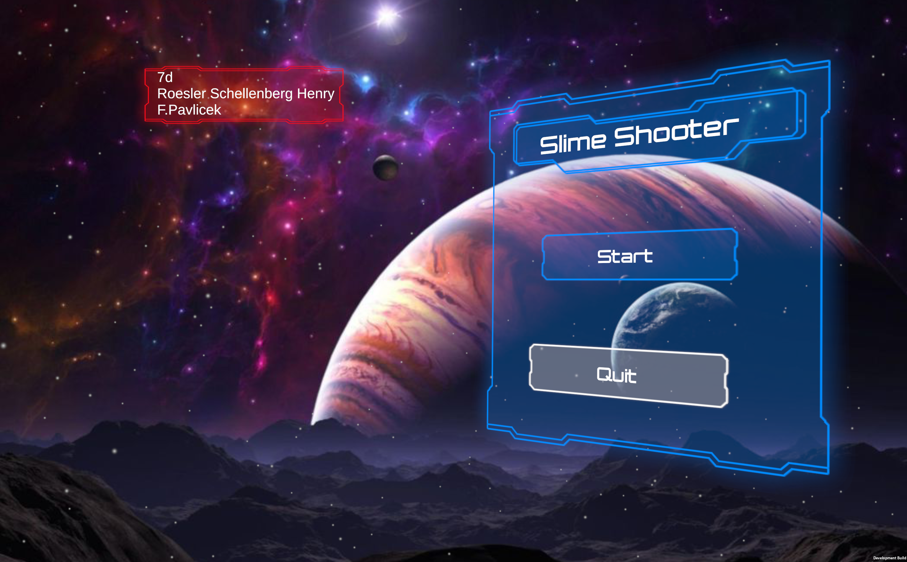
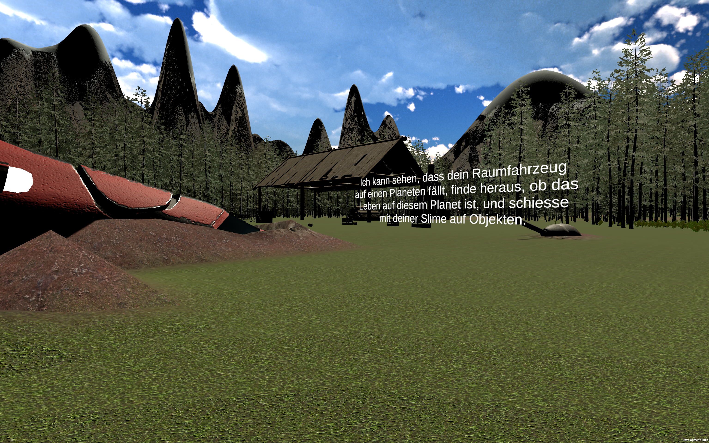
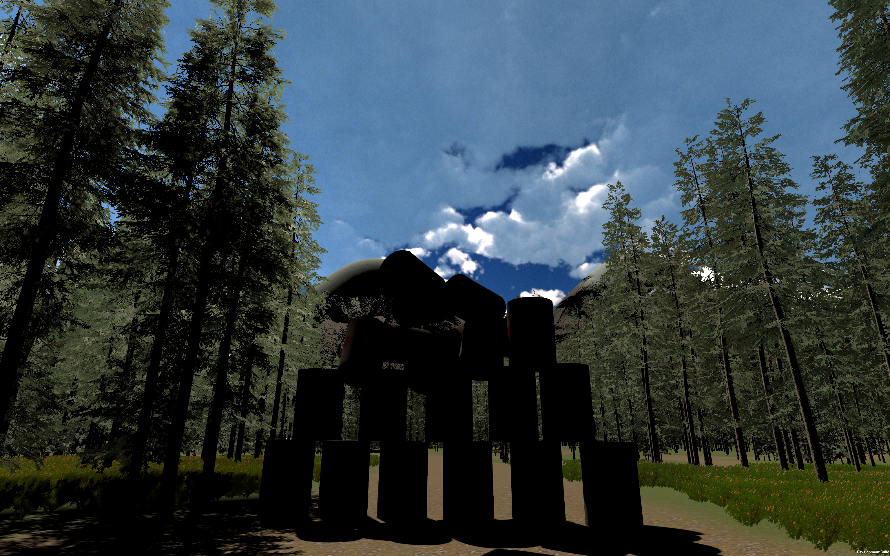
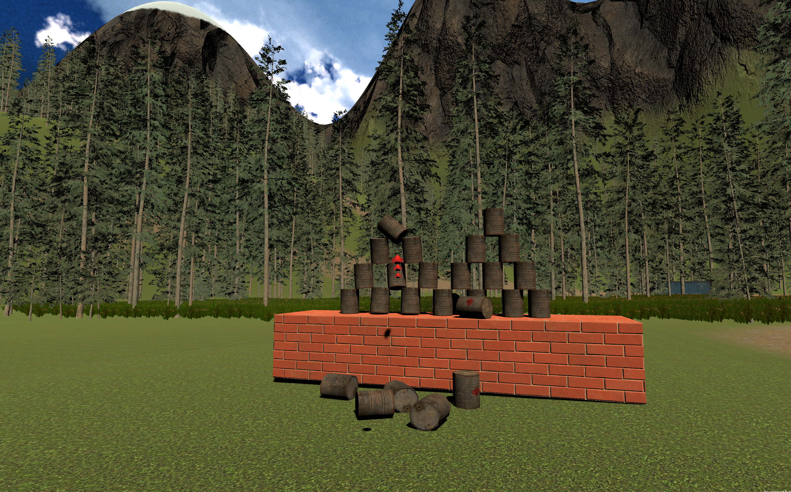

# PA Slime Shooter

A fps like game built in Unity as a personal project for a school 1 week project week, completed on
**21 March 2021**. Engine: **Unity 2020.2.4f1**.

## Gameplay

You move through a 3D level and shoot slimes at objects. Three scenes make up the game:
`Menu`, `Scene1`, and (`Test Level`).

## Screenshots


*Main menu*


*Opening scene: the crashed spacecraft and the mission briefing*


*A stack of targets in the forest clearing*


*`Tin.cs` in action, targets knocked off the wall by hits*

## Code I wrote

All gameplay logic lives in `Assets/Scripts/`. These seven files are mine,

written 16–17 March 2021:

| File | What it does |
|---|---|
| `player.cs` | Movement on a `CharacterController` with WASD, `SmoothDamp` acceleration, and a jump whose gravity and impulse come from a target height and time-to-apex |
| `FirstPersonCamera.cs` | Mouse look |
| `Gun.cs` | Fires on left click: spawns a bullet, then raycasts from the camera against the `hittable` layer |
| `Bullet.cs` | Projectile integrated with gravity, collides via `Physics.OverlapBox` against `hittable` and reports the hit |
| `IShotHit.cs` | One-method interface (`Hit(Vector3 direction)`) implemented by anything shootable |
| `Tin.cs` | A knock-over target implements `IShotHit` and converts the hit direction into a `Rigidbody` force |
| `LoadSceneOnClick.cs` | `LoadScene(string)` hook for menu buttons |

The remaining files in `Assets/Scripts/` are **not mine**. They came from
Unity's UI sample scripts and Unity Standard Assets

## Assets not included in this repository

The project used around 3 GB of Unity Asset Store packs and downloaded
media. Those are omitted here. Asset Store licences do not permit
redistributing pack contents, and some of the audio is copyrighted.

Excluded packs: `ADG_Textures`, `Ada_King`, `Fallen Tree Barrier - FREE`,
`Gamer Squid`, `Grass And Flowers Pack 1`, `Plants`, `Rusty plane`,
`Samples`, `SkySerie Freebie`, `Standard Assets`, `Space_Objects`, `Stump`,
`Suburban Structure Kit`, `TextMesh Pro`, `Wooden_Canopy`,
`WorldMaterialsFree`, `boxes`, `illusionloop.com`, `industria`, `tricycle`.

Excluded media: `Slime_Alien.mp4`, `Star_Wars_Audio.mp3`,
`[RPG] Floresta (Som de Ambiente).mp3`, `Planets.mp3`.

**Consequence:** cloning this repository and opening it in Unity will show
the scenes with missing meshes, materials and audio. The scripts, scenes,
prefabs and project configuration are all here and readable, but the
project will not build into the playable game without re-importing the
packs above.

## Repository contents

```
Assets/Scripts/    gameplay code (7 files mine, 15 imported)
Assets/*.unity     Menu, Scene1, Test Level
Assets/Prefabs/    prefabs
Assets/Models/     models
Assets/Animation/  animation clips
Assets/Fonts/      fonts
Images/            screenshots
ProjectSettings/   Unity project configuration
Packages/          package manifest
```
